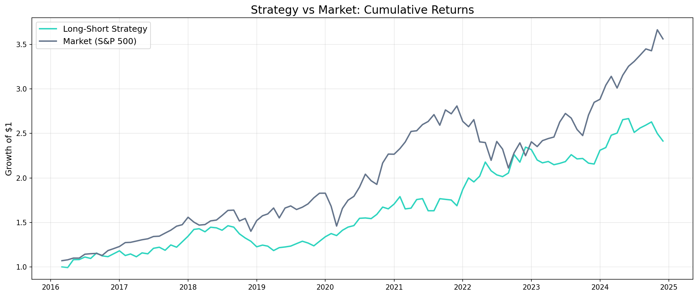

# 多因子选股策略回测框架

基于 Carhart 四因子模型（市场、SMB、HML、WML）的多空股票策略回测器。使用 50 只 S&P 500 成分股，回测区间为 2015–2024 年（10年）。

## 回测结果

| 指标 | 数值 |
|------|------|
| 年化收益 | 10.87% |
| 年化波动率 | 13.21% |
| Sharpe Ratio | 0.68 |
| 最大回撤 | -19.07% |
| 月胜率 | 56.60% |
| Alpha（年化，Newey-West 修正） | 9.76%（t=2.58, p=0.0098） |

## 策略概述

每月执行以下操作：

1. **因子打分**：对 50 只股票按三个因子打分——动量（过去 12-1 个月累计收益）、价值（价格倒数作为账面市值比代理）、规模（价格作为市值代理）
2. **排名合成**：将三个因子的百分位排名等权平均，得到综合得分
3. **构建组合**：做多综合得分最高的 10 只，做空最低的 10 只
4. **月度调仓**：等权配置，每月重新打分换仓

## 核心发现

- **Alpha 在 1% 水平下显著**——控制 Fama-French 四因子后，策略仍有 9.76% 的年化超额收益，说明综合打分方法捕捉到了超出标准因子暴露的收益
- **综合因子优于任何单因子**——综合策略 Sharpe（0.68）高于动量（0.16）、规模（0.59）和价值（0.59）
- **跨时段稳健**——在所有测试区间（2016–2019、2020–2024、COVID 前后）均有正 Sharpe
- **跨参数稳健**——做多/做空 5、10、15 只股票时 Sharpe 均高于 0.50

## 局限性

- **生存偏差**：仅包含当前 S&P 500 成分股，已退市股票未纳入
- **因子代理变量**：用价格代替市值（规模因子），用价格倒数代替账面市值比（价值因子），而非真实基本面数据
- **无交易成本**：未考虑手续费、滑点和市场冲击
- **样本有限**：50 只股票是一个较小的投资宇宙

## 项目结构

    multi-factor-equity-strategy/
    ├── README.md
    ├── requirements.txt
    ├── data/
    │   ├── raw/                  # 原始价格数据
    │   └── processed/            # 收益率、因子得分、回测结果
    ├── src/
    │   ├── data_loader.py        # 从 yfinance 下载股票价格
    │   ├── factor_data.py        # 下载并合并 Fama-French 因子数据
    │   ├── factors.py            # 因子构建与打分
    │   ├── backtest.py           # 组合回测引擎
    │   └── analytics.py          # 统计检验（Fama-MacBeth、Newey-West）
    ├── notebooks/
    │   ├── 01_data_exploration.ipynb
    │   └── 02_backtest_results.ipynb
    ├── output/
    │   └── figures/
    └── docs/
        └── methodology.md

## 如何复现

    bash
    # 克隆仓库
    git clone https://github.com/HuiqiZhao1/Multi-factor-Equity-Strategy.git
    cd Multi-factor-Equity-Strategy

    # 安装依赖
    pip install -r requirements.txt

    # 第一步：下载股票价格数据
    python3 src/data_loader.py

    # 第二步：下载并合并因子数据
    python3 src/factor_data.py

    # 第三步：计算因子得分
    python3 src/factors.py

    # 第四步：运行回测
    python3 src/backtest.py

    # 第五步：统计检验
    python3 src/analytics.py

## 数据来源

- **股票价格**：[Yahoo Finance](https://finance.yahoo.com/)（通过 yfinance API）
- **因子数据**：[Kenneth French Data Library](https://mba.tuck.dartmouth.edu/pages/faculty/ken.french/data_library.html)

## 技术栈

Python 3.13 · pandas · numpy · statsmodels · yfinance · matplotlib        